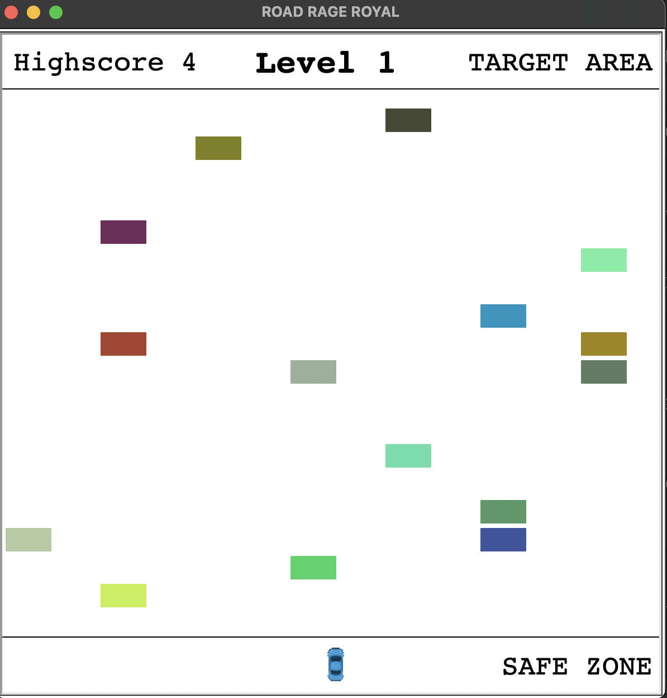
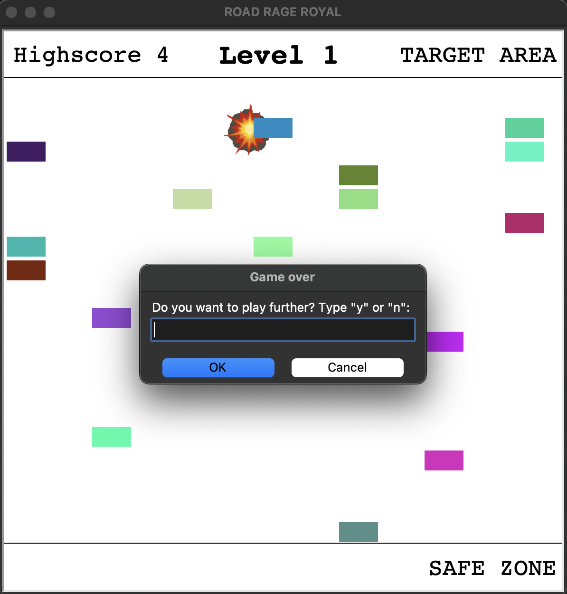
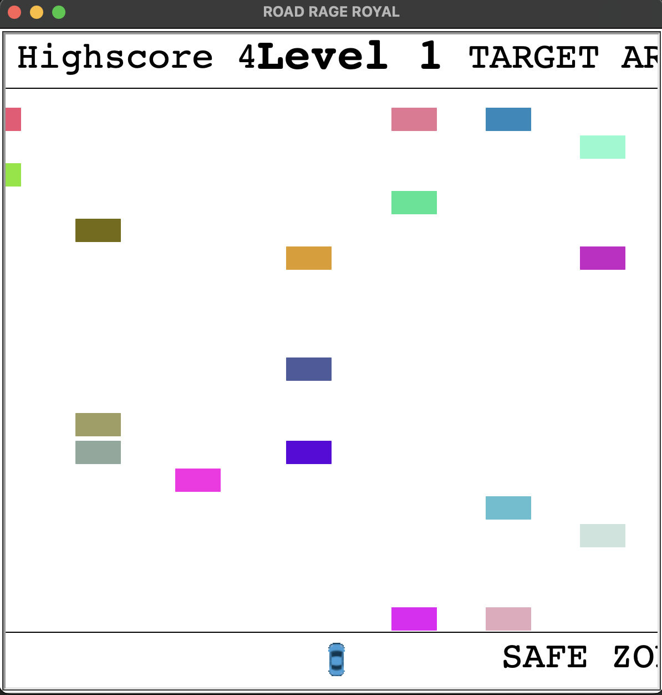

# Road Rage Royal
[]() []() []() []() []() []() []() []()  

Welcome to **Road Rage Royal**, a Python-based arcade game built with Turtle / Tkinter graphics. Navigate your car through increasingly difficult obstacles, avoid crashes, and strive to reach the highest level possible!

---





---
## Table of Contents
- [Overview](#overview)  
- [Project Structure](#project-structure)
- [Setup](#setup)
  - [Prerequisites](#prerequisites)
  - [Installation](#installation)
  - [Run the Game](#run-the-game)
- [How to Play](#how-to-play)
- [Testcases / QA](#testcases--qa)
  - [Continuous Integration and Deployment (CI/CD)](#continuous-integration-and-deployment-cicd)
  - [Run Tests Locally](#run-tests-locally)
  - [Add Pre-Push Hook](#add-pre-push-hook-macos)
- [Code Architecture](#code-architecture)
  - [Design Patterns and Principles](#design-patterns-and-principles)
  - [Game Components](#game-components)
  - [Testing Strategy](#testing-strategy)
- [License](#license)  
- [Contact](#contact)

---

## Overview
Road Rage Royal is a fast-paced arcade game where you control a car navigating through hazardous blocks:
- Control a car with arrow keys, aiming to reach the top of the screen
- Avoid block obstacles that move from right to left
- Each time you reach the top, you advance to the next level
- Game difficulty increases with each level: faster blocks, more obstacles, and less space to maneuver
- Your highscore is persistently saved in a local SQLite database
- Game features collision detection, level progression, and difficulty scaling

The project is build with object-oriented design principles with clean architecture, comprehensive test coverage via `pytest`, and efficient game mechanics.

---

## Project Structure
```
road-rage-royal/
├── assets/            # Game graphics (car.gif, explosion.gif)
├── data/              # Highscore database storage
├── docs/              # Documentation and screenshots
├── src/               # Source code
│   ├── __init__.py
│   ├── block_manager.py  # Block obstacle management
│   ├── helpers.py        # Utility functions
│   ├── highscore_db.py   # Database management
│   ├── main.py           # Core game loop
│   ├── player.py         # Player car logic
│   ├── screen.py         # Game screen setup
│   └── scoreboard.py     # Score display
├── tests/             # Test files
│   ├── __init__.py
│   ├── test_block_manager.py
│   ├── test_helpers.py
│   ├── test_highscore_db.py
│   ├── test_main.py
│   ├── test_player.py
│   ├── test_scoreboard.py
│   └── test_screen.py
├── run.py             # Game entry point
├── pytest.ini         # Pytest configuration
├── requirements.txt   # Dependencies
└── README.md          # This document
```
---

## Setup

### Prerequisites
- **Python 3.12.3** (recommended for optimal experience)
- **Tkinter 8.6** (included with Python 3.12.3)

> **Compatibility Note:** While the game will run on Python 3.13+ with Tkinter 9.0, you may experience minor display issues with text sizing. The core gameplay mechanics will function correctly regardless. See the minor issues on the following screenshot:



### Installation
1. Clone the repository:
```bash
git clone https://github.com/kenobijr/road-rage-royal.git
cd road-rage-royal
```

2. Create and activate a virtual environment (recommended):
```bash
# On macOS/Linux
python3 -m venv venv
source venv/bin/activate

# On Windows
python -m venv venv
venv\Scripts\activate
```

3. Install dependencies:
```bash
pip install -r requirements.txt
```

### Run the Game
Launch the game with:
```bash
python run.py
```

---

## How to Play

### Objective
- Navigate your car from the bottom "SAFE ZONE" to the "TARGET AREA" at the top of the screen while avoiding obstacles
- Each time you reach the top, you advance to the next level
- With each level, the game becomes progressively more difficult
- Try to achieve the highest level possible before crashing

### Controls
- **Up Arrow:** Move up
- **Down Arrow:** Move down (not allowed within the SAFE ZONE)
- **Left Arrow:** Move left
- **Right Arrow:** Move right

### Gameplay Elements
- **Car:** The player-controlled vehicle starting at the bottom of the screen
- **Obstacles:** Colorful blocks moving from right to left that must be avoided
- **Safe Zone:** Starting area at the bottom of the screen
- **Target Area:** The goal at the top of the screen that advances you to the next level

### Game Progression
1. Start in the Safe Zone at level 1
2. Navigate through obstacles to reach the Target Area
3. Upon reaching the Target Area, you'll advance to the next level
4. The difficulty increases:
   - Blocks move faster
   - Increased probability of more blocks appearing simultaneously
   - Block patterns become more challenging
5. If your car collides with a block, an explosion animation plays and the game ends
6. You can choose to play again or exit

### Highscore
Your highest achieved level is saved as a highscore in a local database, allowing you to track improvement across game sessions.

---

## Testcases / QA

### Continuous Integration and Deployment (CI/CD)
This project utilizes **GitHub Actions** for automated testing and deployment. All `pytest` test cases are automatically executed with every push or pull request to the `main` branch.

**Key CI/CD Features:**
1. **Test Automation**: All pytest test cases automatically run in the CI pipeline for every push or pull request to the main branch.
2. **Branch Protection**: The main branch is protected, preventing merges if test cases fail during the CI workflow.
3. **Environment Consistency**: Tests run in a clean environment (ubuntu-latest), ensuring they are reproducible and not dependent on local setups.
4. **Dependency Management**: The workflow installs all required dependencies from requirements.txt and uses Python 3.12.

For detailed configuration, check the workflow file in `.github/workflows/python-tests.yml`.

### Run Tests Locally
Execute the comprehensive test suite with pytest:
```bash
# In the project's root directory:
pytest
```

This will run all test cases and report coverage, ensuring game functionality works as expected.

### Add Pre-Push Hook (macOS)
To prevent pushing code that fails tests:

1. Create the pre-push hook:
```bash
mkdir -p hooks
cat > hooks/pre-push << 'EOF'
#!/bin/sh

echo "Running tests before push..."
python -m pytest
if [ $? -ne 0 ]; then
  echo "Tests failed. Aborting push."
  exit 1
fi
exit 0
EOF
```

2. Copy to Git hooks directory and make executable:
```bash
cp hooks/pre-push .git/hooks/pre-push
chmod +x .git/hooks/pre-push
```

---

## Code Architecture
Road Rage Royal follows a modular, object-oriented design that emphasizes clean separation of concerns and maintainability.

### Design Patterns and Principles

#### Object Composition
The game heavily utilizes composition over inheritance, particularly in the core classes:
- `Game` class composes `Player`, `BlockManager`, `Scoreboard`, and other components
- `Player` and `Block` classes compose Turtle objects rather than inheriting from them
- This approach creates a flexible architecture with clearer responsibilities

#### Singleton Pattern
- The `HighscoreDB` class implements a thread-safe singleton pattern to ensure a single database connection throughout the application
- This pattern provides global access while controlling instantiation

#### MVC-Inspired Architecture
While not strictly MVC, the game follows similar separation:
- **Model:** `BlockManager`, `Player`, and `HighscoreDB` handle game state
- **View:** `GameScreen` and `Scoreboard` manage visual representation
- **Controller:** `Game` class coordinates interactions between components

### Game Components

#### Screen Management (`screen.py`)
- Configures the game window and visual boundaries
- Handles event registration and screen updates
- Manages custom shape registration for game sprites

#### Player Control (`player.py`)
- Manages the player's car movement and boundaries
- Handles reset mechanics when advancing levels or after collisions
- Provides position data for collision detection

#### Block System (`block_manager.py`)
- Generates, moves, and removes obstacle blocks
- Implements difficulty scaling based on level
- Controls block batch generation with non-overlapping patterns

#### Game Coordination (`main.py`)
- Orchestrates the game loop and state management
- Handles collisions, level progression, and game resets
- Manages player input and difficulty advancement

#### Persistence (`highscore_db.py`)
- Implements SQLite database interaction with the singleton pattern
- Provides thread-safe access to persistent highscore data
- Handles graceful connection management

#### Utilities (`helpers.py`)
- Provides collision detection algorithms
- Generates random colors and block batches
- Handles visual effects like explosion animations

### Testing Strategy
The project features comprehensive test coverage with pytest:
- **Parameterized Tests:** Used extensively to verify functionality with multiple inputs
- **Mocking:** Applied to isolate certain components during testing
- **Fixtures:** Used to set up and tear down test environments
- **Component Testing:**  Each module has dedicated test files that verify its functionality

**Note on GUI Testing:** While many components are mocked in tests, you may notice that the GUI briefly appears during test execution. This occurs because certain parameters are stored within Turtle/Screen objects themselves. A full decoupling from GUI components would have required significant refactoring, so the tests were designed to work with this brief GUI appearance as a practical compromise.

---

## License
This project is licensed under the MIT License. See the [LICENSE](LICENSE) file for more details.

---

## Contact
Feel free to reach out for collaboration or questions:

https://github.com/kenobijr

[mail](mailto:22.scree_rhino@icloud.com)